# Trabalho 2 - Greed (Algoritmos Ambiciosos)

**Número do trabalho:** 2 <br>
**Conteúdo da Disciplina: Greed (Algoritmos Ambiciosos)**

## Alunos

| Matrícula |          Nome Completo           |
| :-------: | :------------------------------: |
| 200041959 | Mauricio Machado Fernandes Filho |
| 221008202 |   José Eduardo Vieira do Prado   |

## Descrição

Este projeto implementa um **Sistema de Compressão de Arquivos usando o Algoritmo de Huffman** com interface web interativa. O objetivo é demonstrar visualmente como o algoritmo de Huffman constrói árvores de codificação ótima para compressão de dados, permitindo que usuários comprimam e descomprimam arquivos de texto de forma educativa e interativa.

O sistema utiliza listas encadeadas (chained lists) para evitar overflow de arrays, constrói a árvore de Huffman seguindo o algoritmo clássico (mesclando nós da esquerda para direita por frequência) e gera códigos binários únicos para cada caractere.

## Tecnologias Utilizadas

### Backend

- **Python 3** - Linguagem de programação principal
- **Flask** - Framework web para servir a aplicação
- **Werkzeug** - Biblioteca para manipulação de arquivos

### Frontend e Visualização

- **HTML5** - Estrutura da interface web
- **CSS3** - Estilização e design responsivo
- **JavaScript (ES6+)** - Lógica do cliente e interatividade
- **D3.js v7** - Biblioteca para visualização interativa da árvore de Huffman com zoom/pan
- **JSZip** - Biblioteca para criação de arquivos ZIP no lado do cliente

### Algoritmos e Estruturas de Dados

- **Algoritmo de Huffman** - Implementação completa com visualização
- **Listas Encadeadas (Chained Lists)** - Estrutura para evitar overflow de arrays
- **Árvores Binárias** - Estrutura de dados para representar a codificação
- **Priority Queue Manual** - Implementação via lista encadeada ordenada

## Funcionalidades Principais

### 📁 **Upload de Arquivos**

- Seleção múltipla de arquivos .txt (até 500MB por arquivo)
- Exibição do tamanho total dos arquivos selecionados
- Validação de tipo de arquivo
- Interface drag-and-drop intuitiva
- Limpeza automática de dados anteriores entre operações

### 🗜️ **Compressão com Algoritmo de Huffman**

- Análise de frequência de caracteres
- Construção da árvore de Huffman usando listas encadeadas
- Mesclagem de nós da esquerda (menor frequência) para direita
- Geração automática de códigos binários (esquerda=0, direita=1)
- Codificação de pile/unpile (da folha até a raiz)
- Compressão real em formato binário (não texto)
- Formato de arquivo personalizado: header + metadata JSON + bytes comprimidos

### 📊 **Visualização Interativa**

- Árvore de Huffman renderizada com D3.js
- Nós internos (pretos) e nós folha (azuis) com caracteres
- Arestas rotuladas com 0 (esquerda) e 1 (direita)
- Frequências exibidas acima de cada nó
- Tabela de códigos de Huffman para cada caractere
- Zoom e pan interativos na visualização da árvore
- Ajuste automático de tamanho baseado na profundidade da árvore

### 📈 **Análise de Compressão**

- Comparação de tamanho original vs comprimido
- Taxa de compressão percentual
- Estatísticas individuais por arquivo
- Estatísticas totais para múltiplos arquivos
- Resultados modulares para cada arquivo processado

### 💾 **Download de Arquivos Comprimidos**

- Download individual de arquivos .huff comprimidos
- Download individual de tabelas de códigos em formato JSON
- **Download em lote**: botão "Download All as ZIP" para baixar todos os arquivos comprimidos e suas tabelas de códigos em um único arquivo ZIP
- Formato de arquivo otimizado para compressão real

### 🔓 **Funcionalidade de Decodificação**

- **Dois modos de operação**: página inicial dedicada ao modo decodificação
- **Upload múltiplo**: suporte para decodificar vários arquivos .huff simultaneamente
- Interface para inserir dados binários comprimidos (opcional)
- Decodificação usando a tabela de códigos embutida no arquivo .huff
- **Decodificação client-side**: processamento no navegador para arquivos grandes (evita problemas de memória no servidor)
- Exibição do texto original recuperado com preview
- Download individual de arquivos decodificados
- **Download em lote**: botão "Download All Decoded as ZIP" para baixar todos os textos decodificados
- Resultados modulares por arquivo decodificado
- Alertas para arquivos muito grandes durante processamento

### ⏳ **Estados de Loading e Feedback**

- Spinner animado durante processamento de compressão
- Spinner animado durante processamento de decodificação
- Indicadores de progresso para operações com múltiplos arquivos
- Feedback visual claro para o usuário
- Transições suaves entre estados
- Mensagens de erro detalhadas quando necessário

### 🎯 **Otimizações de Performance**

- Processamento em chunks para arquivos grandes (evita overflow de memória)
- Decodificação client-side para arquivos acima de 10MB
- Conversão otimizada de bytes para strings binárias
- Limite de 500MB por arquivo configurável
- Limpeza de memória entre operações

## Vídeo Demonstrativo

🎥 [Assista ao vídeo demonstrativo do projeto](https://youtu.be/b6jijAY1xhI)

## Screenshots da Aplicação

### Tela Inicial

Interface inicial com seleção de modo (Comprimir ou Decodificar).

<a href="assets/huffman_start_page.png">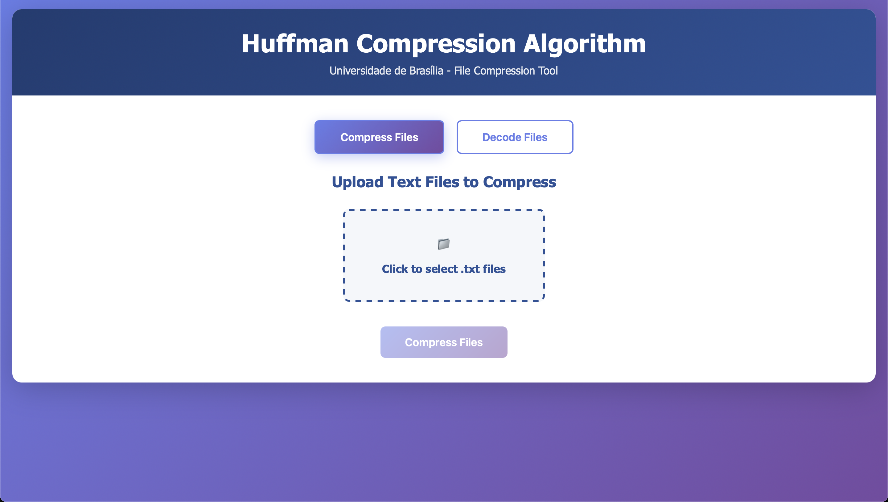</a>

### Arquivos Selecionados para Compressão

Visualização dos arquivos .txt selecionados com tamanho total.

<a href="assets/huffman_start_page_compress_added_file.png">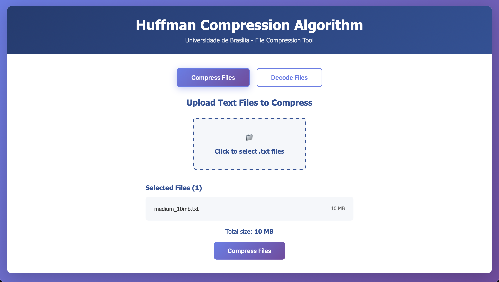</a>

### Processamento de Compressão

Animação de loading durante a compressão dos arquivos.

<a href="assets/huffman_compressing_loading_page.png">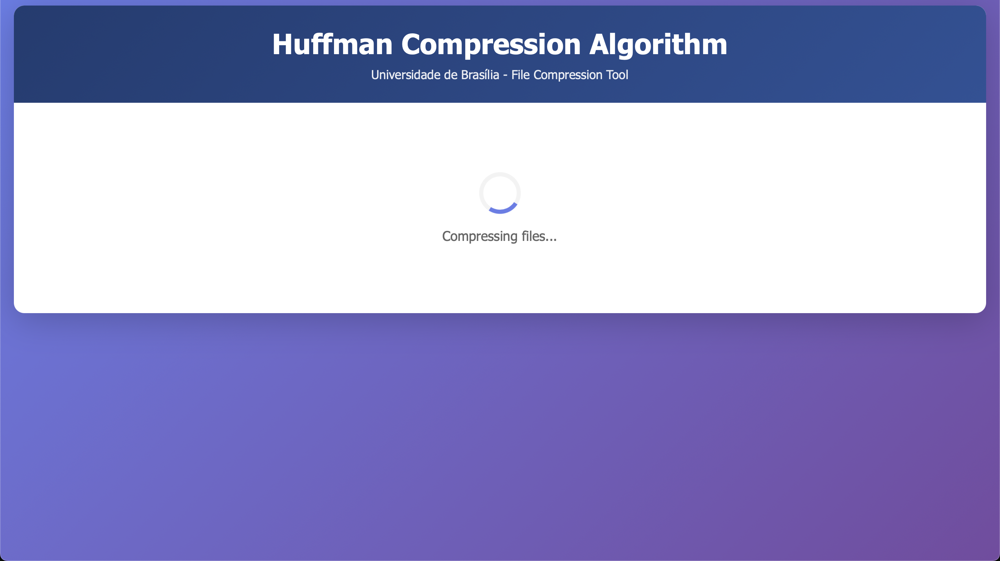</a>

### Resultados da Compressão - Parte 1

Estatísticas gerais de compressão (tamanho original, comprimido, taxa de compressão).

<a href="assets/huffman_compressing_results_pt_1.png">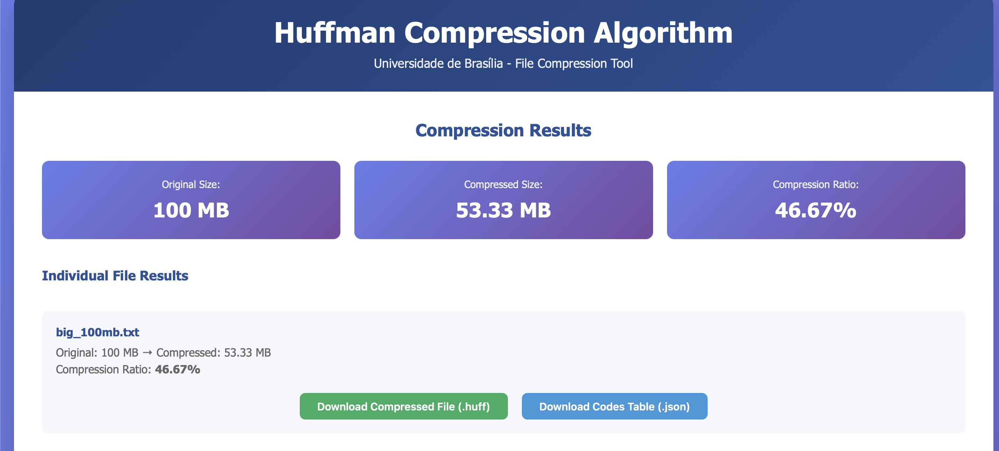</a>

### Resultados da Compressão - Parte 2

Resultados individuais por arquivo com opção de download.

<a href="assets/huffman_compressing_results_pt_2.png">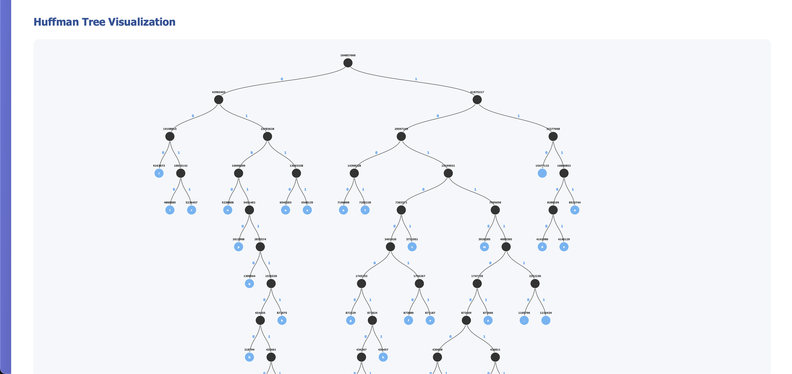</a>

### Resultados da Compressão - Parte 3

Visualização interativa da árvore de Huffman construída com D3.js.

<a href="assets/huffman_compressing_results_pt_3.png">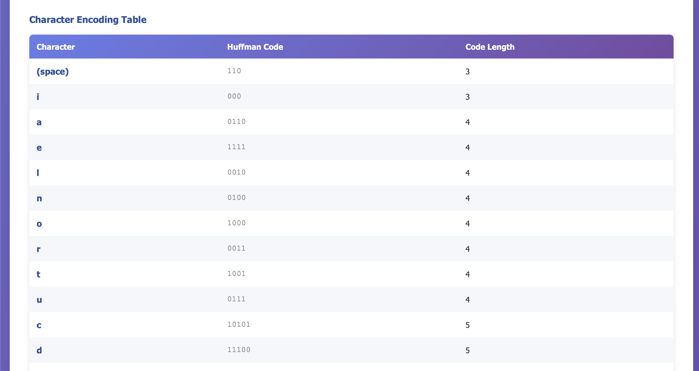</a>

### Resultados da Compressão - Parte 4

Tabela de códigos de Huffman e seção de decodificação.

<a href="assets/huffman_compressing_results_pt_4.png">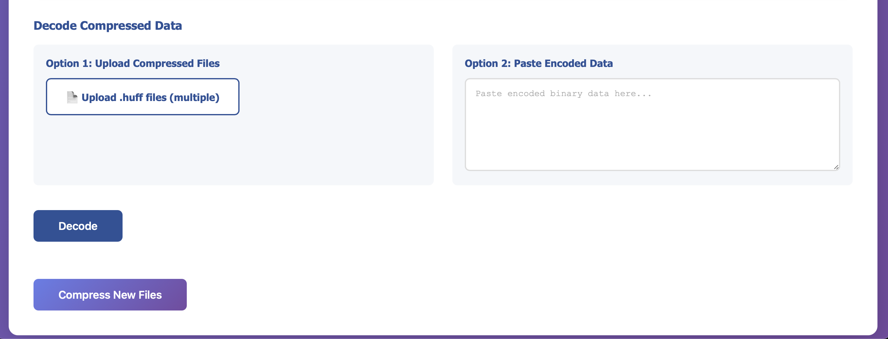</a>

### Modo de Decodificação

Interface para upload de arquivos .huff comprimidos (suporte a múltiplos arquivos).

<a href="assets/huffman_decode_start_page.png">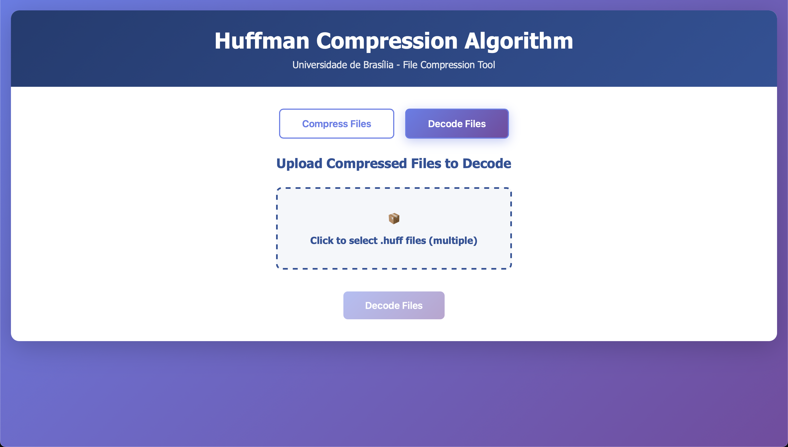</a>

### Aviso de Arquivo Grande

Alerta ao processar arquivos grandes durante a decodificação.

<a href="assets/huffman_decode_large_file_warning.png">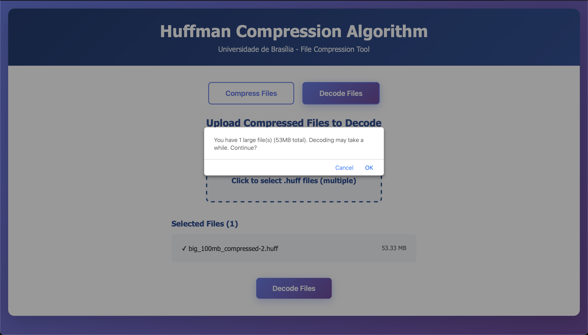</a>

### Processamento de Decodificação

Animação de loading durante a decodificação dos arquivos.

<a href="assets/huffman_decode_loading_page.png">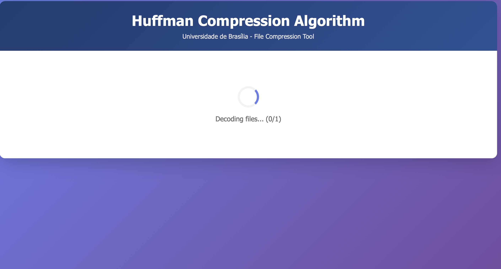</a>

### Resultados da Decodificação - Parte 1

Preview do texto decodificado com estatísticas.

<a href="assets/huffman_decode_results_pt_1.png">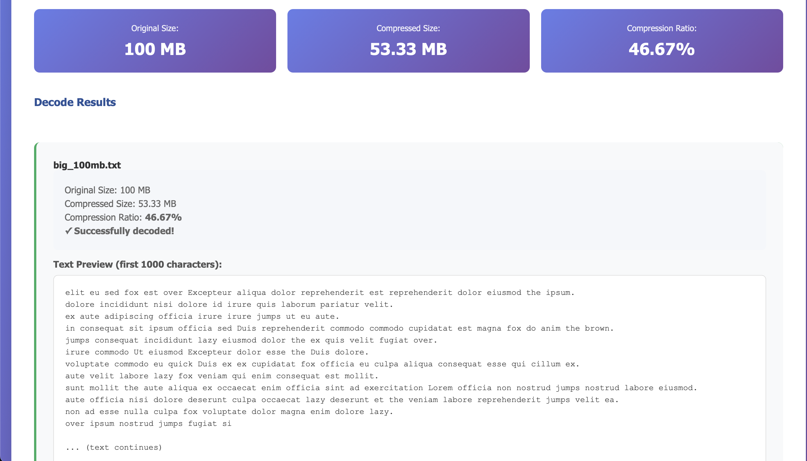</a>

### Resultados da Decodificação - Parte 2

Resultados modulares para múltiplos arquivos com opção de download individual ou em ZIP.

<a href="assets/huffman_decode_results_pt_2.png">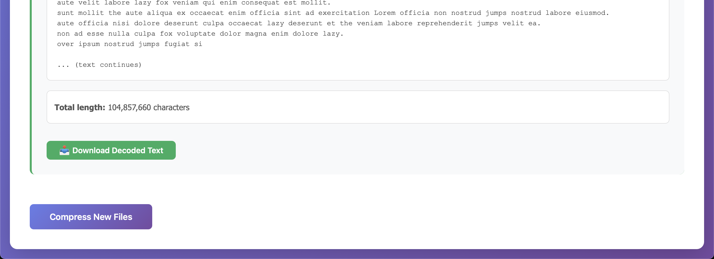</a>

## Arquitetura do Sistema

### **Camada de Backend (Python)**

- **huffman.py**:

  - `Node`: Classe para nós da árvore de Huffman
  - `ChainedListNode`: Nó de lista encadeada
  - `ChainedList`: Lista encadeada ordenada por frequência
  - `HuffmanCoding`: Classe principal com algoritmo completo

- **app.py**:
  - Rotas Flask para upload e compressão
  - Endpoint `/compress` para processar arquivos
  - Endpoint `/decode` para decodificar dados
  - Serialização JSON da árvore para visualização

### **Camada de Frontend (JavaScript)**

- **main.js**:
  - Gerenciamento de upload de arquivos
  - Comunicação assíncrona com backend
  - Renderização de resultados
  - Integração com D3.js para visualização
  - Lógica de decodificação

### **Camada de Visualização (D3.js)**

- Geração dinâmica de SVG para árvore
- Layout hierárquico automático
- Rotulação de nós e arestas
- Responsividade e zoom

## Como Executar

### Pré-requisitos

- Python 3.7 ou superior instalado
- Conexão com internet (para carregar D3.js via CDN)

### Instruções

1. Clone este repositório:

```bash
git clone <url-do-repositorio>
cd Trabalho_Greed_UnB_2025_2
```

2. Crie e ative o ambiente virtual:

```bash
python3 -m venv venv
source venv/bin/activate  # No Windows: venv\Scripts\activate
```

3. Instale as dependências:

```bash
pip install -r requirements.txt
```

4. Execute a aplicação:

```bash
python app.py
```

5. Abra seu navegador e acesse:

```
http://localhost:5000
```

### Estrutura de Arquivos

```
Trabalho_Greed_UnB_2025_2/
├── app.py                 # Aplicação Flask principal
├── huffman.py            # Implementação do algoritmo de Huffman
├── requirements.txt      # Dependências Python
├── venv/                 # Ambiente virtual (não versionado)
├── uploads/              # Diretório para arquivos temporários
├── templates/
│   └── index.html       # Interface HTML principal
├── static/
│   ├── css/
│   │   └── style.css    # Estilos da aplicação
│   └── js/
│       └── main.js      # Lógica JavaScript e D3.js
└── README.md            # Este arquivo
```

## Uso da Aplicação

### Modo Compressão

1. **Selecionar Modo**:

   - Na página inicial, certifique-se de que o modo "Compress Files" está ativo (botão azul/roxo)

2. **Upload de Arquivos**:

   - Clique na área de upload ou arraste arquivos .txt
   - Visualize a lista de arquivos selecionados e tamanho total
   - Suporte para múltiplos arquivos (até 500MB cada)

3. **Compressão**:

   - Clique no botão "Compress Files"
   - Aguarde o processamento (spinner animado)

4. **Visualização dos Resultados**:

   - Veja o resumo de compressão (tamanho original, comprimido, taxa)
   - Consulte os resultados individuais de cada arquivo
   - Explore a árvore de Huffman interativa com zoom/pan
   - Consulte a tabela de códigos gerada

5. **Download**:

   - **Individual**: Clique em "Download .huff" ou "Download Codes JSON" para cada arquivo
   - **Em lote**: Clique em "Download All as ZIP" para baixar todos os arquivos comprimidos de uma vez

6. **Decodificação na Página de Resultados** (opcional):

   - Na seção "Decode Compressed Data", faça upload de arquivos .huff ou cole dados binários
   - Clique em "Decode" para recuperar o texto original
   - Suporte para múltiplos arquivos .huff simultaneamente

7. **Nova Compressão**:
   - Clique em "Compress New Files" para reiniciar o processo

### Modo Decodificação

1. **Selecionar Modo**:

   - Na página inicial, clique no botão "Decode Files" para alternar para o modo de decodificação

2. **Upload de Arquivos Comprimidos**:

   - Clique na área de upload para selecionar arquivos .huff
   - Suporte para múltiplos arquivos simultaneamente
   - Visualize a lista de arquivos selecionados

3. **Decodificação**:

   - Clique no botão "Decode Files"
   - Aguarde o processamento (spinner animado)
   - Arquivos grandes (>10MB) são processados no navegador para melhor performance

4. **Visualização dos Resultados**:

   - Veja o preview do texto decodificado
   - Consulte estatísticas de cada arquivo (tamanho decodificado, número de caracteres)
   - Resultados modulares para cada arquivo processado

5. **Download**:

   - **Individual**: Clique em "Download Decoded Text" para cada arquivo
   - **Em lote**: Clique em "Download All Decoded as ZIP" para baixar todos os textos de uma vez

6. **Nova Decodificação**:
   - Use os botões de navegação para voltar e processar novos arquivos

## Aspectos Técnicos do Algoritmo de Huffman

### **Construção da Árvore**

1. **Análise de Frequência**: Percorre o texto contando ocorrências de cada caractere
2. **Criação de Nós Iniciais**: Cria um nó folha para cada caractere com sua frequência
3. **Inserção em Lista Ordenada**: Usa lista encadeada ordenada por frequência (menor → maior)
4. **Mesclagem Iterativa**:
   - Remove os dois nós com menor frequência (mais à esquerda)
   - Cria nó interno com soma das frequências
   - Reinsere na posição correta da lista ordenada
   - Repete até restar apenas um nó (raiz)

### **Geração de Códigos**

- Percorre recursivamente a árvore
- Esquerda = adiciona '0' ao código
- Direita = adiciona '1' ao código
- Ao atingir folha, armazena o código completo

### **Codificação e Decodificação**

- **Codificação**: Substitui cada caractere pelo seu código binário
- **Decodificação**: Percorre a árvore seguindo os bits (0=esquerda, 1=direita) até atingir uma folha

## Aspectos Educacionais

Este projeto serve como ferramenta educacional para:

- Compreensão visual do algoritmo de Huffman
- Demonstração de algoritmos ambiciosos (greedy)
- Aplicação prática de compressão de dados
- Uso de estruturas de dados (árvores, listas encadeadas)
- Análise de eficiência de compressão
- Integração frontend-backend

## Vídeo Demonstrativo

🎥 [Assista ao vídeo demonstrativo do projeto](https://youtu.be/b6jijAY1xhI)

## Linguagens Utilizadas

- **Python** - Backend e implementação do algoritmo
- **JavaScript** - Frontend e visualização
- **HTML/CSS** - Interface e design

## Referências

- [Algoritmo de Huffman - Wikipedia](https://pt.wikipedia.org/wiki/Codifica%C3%A7%C3%A3o_de_Huffman)
- [Flask Documentation](https://flask.palletsprojects.com/)
- [D3.js Documentation](https://d3js.org/)
- Material de aula - Universidade de Brasília

---

**Desenvolvido para a disciplina de Projeto de Algoritmos - Universidade de Brasília (UnB) - 2025/2**
